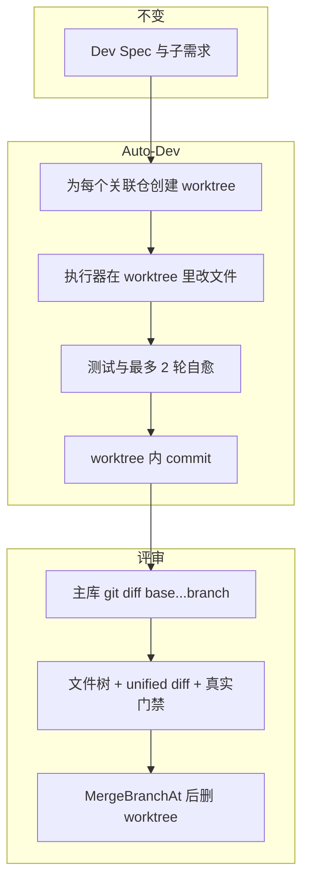

# Auto-Dev：隔离执行、可插拔编码、真实评审

> 开发设计文档（已落地）。实现以仓库代码为准；README 中有面向用户的 worktree / CLI / YOLO 说明。

## 背景与目标

规格驱动的看板流程不变：对话 → Dev Spec →（可选拆分子需求）→ Auto-Dev → 人工评审 → 本地合并。要改的是 **Auto-Dev 怎么改代码、改在哪、人怎么审**。

今天的三条硬伤：

- 在用户真实仓库里 `checkout` 特性分支，工作区 dirty 就失败，同仓不能并行。
- 编码只有内置 VibeBot：LLM 单轮吐整文件 JSON，不能探索仓库、不能自己跑命令。
- Review 页是占位质量报告（假的 +98/-14、写死「已通过」），看不到真实 diff。合并时仍会切走用户当前分支。

整体解法：

- **编码永远发生在本工程创建的 git worktree 里**
- **怎么编码**交给执行器（内置 LLM 或本机 Claude Code / Cursor / Codex / 自定义 CLI）
- **审的是主库上那条分支的真实 diff**
- **合的时候尽量不碰用户正在用的工作区**



---

## 做成之后什么样

1. 主仓可以停在别的分支、可以有未提交改动，Auto-Dev 照样能跑；主仓 `HEAD` 与 dirty 状态不变。
2. 设置里选编码方式：默认 **内置 LLM（VibeBot）**；也可选 **Claude Code / Cursor / Codex / 自定义命令**。未安装的 CLI 灰色并给出安装说明，不代装、不代登录。
3. 控制台 SSE 能看到执行器输出（CLI 按行或解析 stream-json 的工具名）。
4. In Review 看到真实文件列表、unified diff、ahead/behind、真实测试/lint 结果。没有假统计和「已审核通过」套话。
5. 测试失败最多再跑 2 轮；仍失败则回 Backlog，worktree 留着便于对照。
6. Approve 把特性分支合进默认分支（不强制 checkout 脏工作区），然后删除 worktree。可选「用 Cursor / VS Code 打开该 worktree」。

Spec、子需求顺序提交、OpenAI-compatible LLM 配置、桌面/服务双形态，全部保留。

---

## 端到端流程

Worker 每次 `run(job)`：

1. 读全局 `ExecutorConfig`（即时生效，不必重启）。
2. 对每个关联仓库：若空仓则只在主库做一次 `EnsureInitialCommit`；然后  
   `git worktree add -B <ai-dev/issue-xxxx> <dataDir>/worktrees/<issueID>/<repoID> <base>`。  
   主库工作区不切换。路径写入 `issue.PRInfo.Worktrees`。
3. 按子需求或整单调用 `executor.Run`，`cwd` / `RepoPath` 都是 worktree。
4. Worker 在 worktree 里跑测试（失败则自愈，见下）、非阻塞 lint、若仍 dirty 则 `CommitAll`。
5. 成功：issue → `in_review`，记录 `QualityGate` 与所用执行器名。worktree **先留着**（方便打开编辑器）；分支 ref 已在主库，diff 不依赖目录还在。
6. 失败/取消：issue → Backlog；worktree 默认保留，下次 Start 同一 issue 复用同分支。
7. 用户 Approve：`MergeBranchAt` 合进默认分支，再 `RemoveWorktree`。特性分支不自动删除。

对 `.git` 元数据的操作（worktree add/remove、merge）用 **每仓短锁**；编码和测试不持锁，同仓多个 Issue 可以并行。

---

## 1. 隔离工作区

目录：`{dataDir}/worktrees/{issueID}/{repoID}/`（默认 `~/.vibecoding/worktrees/...`）。只用 UUID，避免仓库名特殊字符。`Runner.WorktreeRoot` 在 `appbootstrap` 里注入。

`internal/gitx/gitx.go` 新增：

- `AddWorktree(repoPath, worktreePath, base, branch)`：`git -C repoPath worktree add -B branch worktreePath base`。目录已是该分支的 worktree 则复用。
- `RemoveWorktree(repoPath, worktreePath)`：`worktree remove --force`，没有则 prune。
- `MergeBranchAt(repoPath, base, feature)`：
  - 主仓已在 `base` 且干净 → 原地 `merge --no-ff`。
  - 主仓已在 `base` 但 dirty → **拒绝**，提示先 commit/stash，不再强行 checkout。
  - 主仓不在 `base` → 另建临时 worktree 指向 `base` 再 merge（若 `base` 已被占用则走上面两条）。
- 现有 `CheckoutBranch` 保留，Auto-Dev 主路径不再调用。

单测（扩 `gitx_test.go`）：主仓 dirty 时 AddWorktree 成功且 HEAD 不变；同仓两个 branch 两个 worktree；返工复用；Remove 后 list 里消失。

---

## 2. 编码执行器

新建 `internal/executor/`：`executor.go`、`llm.go`、`agent.go`、`prompt.go`、`probe.go`。把 `worker.go` 里的 `generateCode` 搬进 `llm.go`。

```go
type CodingRequest struct {
    RepoPath, RepoName, Title, Description string
    Spec      *model.DevSpec
    Extra     string
    Snapshots []repocontext.RepoSnapshot // 仅 LLM
    Resume    string                     // CLI session，自愈/返工
}
type Result struct {
    Changes   []model.SpecFileChange // LLM 回填 spec；Agent 可空
    SessionID string
}
type Emit func(phase, msg, details string)
type Executor interface {
    Name() string
    Run(ctx context.Context, req CodingRequest, emit Emit) (Result, error)
}
```

`buildExecutor(cfg)`：`type=llm` → LLMExecutor；`type=agent` → AgentExecutor。

**LLMExecutor（默认）**：采样上下文 → 生成 fileChanges JSON → `ApplyFileWrites` 到 worktree。测试由 worker 在外层循环里跑（见第 3 节）。

**AgentExecutor**：不 JSON dump。用 Spec markdown 拼 prompt，在 worktree 里起子进程。命令来自 preset 模板或用户自定义。`{prompt}` 替换或 `PromptStdin`。stdout 按行 `emit("agent", ...)`；Claude/Cursor 若为 stream-json 再抽 tool 名。超时 `TimeoutSec`（默认 1800）。取消 job → 对子进程 SIGINT。**不要**传 Cursor 的 `--worktree`（会写到 `~/.cursor/worktrees/`）。cwd 必须是本工程 worktree。

Prompt（`prompt.go`，两种执行器共用约束段）：标题、描述、`DevSpec.RawMarkdown`、子需求「只做这一份」、返工/测试失败原文；禁止 push、禁止 merge 默认分支、禁止改 worktree 以外路径。多仓：每个 worktree 顺序跑一次，prompt 写明本仓名。

配置（settings 表 key `executor_config`）：

```go
type ExecutorConfig struct {
    Type        string   // "llm"（默认）| "agent"
    Preset      string   // claude | cursor | codex | custom
    Command     string
    Args        []string // 可含 {prompt}
    PromptStdin bool
    TimeoutSec  int      // 默认 1800
    MaxHeal     int      // 默认 2
}
```

`GET/PUT /api/settings/executor`。PUT：agent 时 preset 必须已知，或 custom 且 `{prompt}` 与 PromptStdin 至少一种。

内置模板：

- `claude`：`claude -p --output-format stream-json --verbose --dangerously-skip-permissions {prompt}`
- `cursor`：`cursor-agent --print --output-format stream-json --force {prompt}`（找不到则 `agent`）
- `codex`：`codex exec {prompt}`
- `custom`：用户填的 Command/Args

无人值守跳过权限 **只因为 cwd 是隔离 worktree**。不把应用内 OpenAPI Key 传给这些 CLI（它们用自己的登录态 / `ANTHROPIC_API_KEY` / `CURSOR_API_KEY`）。

`GET /api/executors`：探测 `claude`、`cursor-agent`|`agent`、`codex`；LLM 项在已配置 Key 时 available。未安装给 hint。未登录导致 Run 失败时，stderr 原样进 Auto-Dev 日志。

本期只做 **全局** 设置（`GlobalSettingsModal.tsx`）。Start Auto-Dev 读当前配置，不必在 start body 里再选一次。Job / PR 记下实际执行器名，Review 顶栏能显示。

可选：`POST /api/issues/{id}/open-editor` `{app: cursor|vscode}`，对 worktree 调 `cursor`/`code`。

---

## 3. 质量门禁与自愈

Worker 在 executor 返回后，对每个 worktree：

```
for round := 0; round <= MaxHeal; round++ {
    if round > 0 {
        extra = 测试失败输出
        再 Run（LLM：带 extra 重新生成；Agent：Resume 或新 prompt 附 stderr）
    }
    runTests(worktree)
    通过或 skipped → break
}
runLint（非阻塞）
若 dirty → CommitAll
写入 QualityGate
```

子需求每一份独立自愈。lint 失败不重试。SSE：`testing: failed, repair round 1/2`。

```go
type QualityGate struct {
    TestsRan, TestsPassed, LintRan, LintPassed bool
    TestsOutput, LintOutput string
    RepairRounds int
}
type WorktreeRef struct { RepoID, RepoName, Path string }
// PRInfo 增加：Worktrees, BaseBranch, Quality, Executor string
```

Issue 仍是 JSON blob，旧数据缺字段当空。

---

## 4. 评审与合并

`GET /api/issues/{id}/diff`：对每个关联仓在 **主库路径** 上（不依赖 worktree 还在）：

- `git diff --numstat base...branch` 与 unified `git diff`
- `git log base...branch`
- `git rev-list --left-right --count` → behind / ahead

单文件 patch > 200KB 则 `truncated` 只保留统计。`quality` 来自 `PRInfo.Quality`。

新组件 `web/src/components/DiffReview.tsx`，替换 `IssueDetailModal.tsx` Review 占位页：

- 顶栏：分支、执行器名、ahead/behind、真实 `+n/-m`（没有就显示 0 或「尚无 diff」，禁止 fallback 98/14）
- 左：按仓分组的文件列表（A/M/D）
- 右：选中文件 unified diff（`<pre>` 按行着色即可）
- 底：四格读 QualityGate；未跑显示「跳过」，失败可展开输出
- 空的 `reviewFeedback` 不渲染通过套话
- 保留「二次修改」「合并代码」；打开 in_review / completed 时拉 diff

硬编码中英文案收到 `i18n.ts`。

合并走 `MergeBranchAt`，成功后清 worktree。返工仍用现有整段 `reviewFeedback`（行内评论以后再做）。

---

## 阶段、单测与提交

按阶段做，**阶段内先写测试再写实现（或同批补齐）**。阶段完成的定义：

1. 该阶段约定的单测全部新加且失败用例会红。
2. `go test ./...` 全绿（阶段 6 若加了前端测试则一并跑）。
3. 新包看覆盖率：`go test -cover ./internal/gitx ./internal/executor ./internal/db ./internal/autodev ./internal/api`。
4. **单独 git commit**，再开始下一阶段。不要把多阶段揉进一次提交。

提交说明跟现有仓库（`feat:` / `fix:` / `docs:`）。每阶段只暂存该阶段文件。

覆盖率底线（新代码，不是整个老 worker 立刻 80%）：

- `internal/gitx` 新增函数：表驱动覆盖 dirty 主仓、双 worktree、返工复用、Remove、MergeBranchAt 的干净/脏/不在 base 三条路径。
- `internal/executor`：**≥70%**（prompt 拼装、preset 展开、`{prompt}`/stdin、探测找不到二进制、LLM 响应 JSON 解析/围栏剥离）。Agent `Run` 用可注入的 fake command，不调用真 `claude`。
- `internal/db`：ExecutorConfig 缺省、写入再读、非法值不污染。
- `internal/autodev`：临时 git 仓 + fake Executor：主仓 HEAD/dirty 不变、失败保留 worktree、heal 次数、QualityGate 写入。
- `internal/api`：httptest 覆盖 GET/PUT executor、GET executors、GET diff（临时仓造两个 commit）、approve-merge 在脏默认分支上返回 4xx。
- 前端目前没有测试框架。阶段 6 只把纯函数（若抽出 diff 着色/文件分组）放到可测模块并补测；组件交互用手动验收，不强行上 Vitest。

### 阶段 1 — gitx 隔离与安全合并

只动 `internal/gitx`。`CheckoutBranch` 保留，worker 暂不改，树始终可编译。

提交：`feat(gitx): add worktree isolation and checkout-safe merge`

### 阶段 2 — 数据模型与持久化

`model.go` + `db.go` 测试（仿 `project_key_test.go`）。

提交：`feat: persist executor config and review quality fields`

### 阶段 3 — executor 包（尚未改 worker 主路径）

新建 `internal/executor`。可从 worker 复制 `generateCode` 进来并单测解析；worker 仍走旧函数，避免半截接线。

提交：`feat: add pluggable coding executor with CLI presets`

### 阶段 4 — worker 改道

`worker.go` + `appbootstrap`：worktree、短锁、自愈、写 Worktrees/QualityGate。此阶段后 Auto-Dev 已在隔离目录跑，Review UI 仍可能是占位页。

提交：`feat(autodev): run jobs in worktrees via executor`

### 阶段 5 — HTTP API

settings / 探测 / diff / MergeBranchAt / open-editor。Worker 已能产出分支后，diff 单测才有意义。

提交：`feat(api): executor settings, issue diff, and safe merge`

### 阶段 6 — 前端

全局「编码执行器」、DiffReview 换掉占位 Review、Console 的 agent 日志、i18n。

提交：`feat(web): executor settings and real diff review`

### 阶段 7 — 用户文档

README 双语补充：worktree 路径、CLI 安装登录、YOLO 仅限 worktree。本设计文档已在 `docs/autodev-isolation-executor-review.md`，实现过程中若有偏差，同步更新本文。

提交：`docs: describe worktree Auto-Dev and coding executors`

---

## 涉及文件

| 文件 | 职责 |
|------|------|
| `internal/gitx/gitx.go` + 测试 | worktree 与安全合并 |
| `internal/executor/` | LLM / Agent 模板 / prompt / 探测 |
| `internal/model/model.go` | ExecutorConfig、WorktreeRef、QualityGate |
| `internal/db/db.go` | Get/PutExecutorConfig |
| `internal/autodev/worker.go` | 主流程改道 |
| `internal/appbootstrap/appbootstrap.go` | WorktreeRoot |
| `internal/api/api.go` | executor settings、executors 探测、diff、open-editor、merge |
| `web/src/types.ts`、`web/src/lib/api.ts` | 类型与客户端 |
| `web/src/components/GlobalSettingsModal.tsx` | 编码执行器 |
| `web/src/components/DiffReview.tsx` | 真实评审 |
| `web/src/components/IssueDetailModal.tsx` | 接入 DiffReview 与 agent 日志 |
| `web/src/lib/i18n.ts`、README | 文案与安全说明 |
| `docs/autodev-isolation-executor-review.md` | 本文（开发设计） |

---

## 验收

每阶段提交前：`go test ./...`。全部结束后再跑一遍覆盖率命令，并做手动路径（设置 CLI、脏主仓、真 diff、Approve）。

手动（全部阶段完成后）：

1. 主仓不在默认分支且有未提交文件 → Start Auto-Dev 成功，主仓状态不变，`~/.vibecoding/worktrees/` 下出现目录。
2. 默认 LLM：Console 有 coding/testing；完成后主库能看到 `ai-dev/issue-*`；Review 是真 diff，不是 98/14。
3. 故意测失败：出现 repair 日志，最终成功或如实失败且 worktree 仍在。
4. 设置切到 Claude / Cursor（本机已装并登录）：worktree 内有真实改动，SSE 有 CLI 输出；未登录则日志为 CLI 原文。
5. Approve：默认分支包含提交，worktree 被删；主仓若脏且正停在默认分支则拒绝合并并提示。
6. 未装任何 CLI 时，LLM 路径仍可用；设置里对应 preset 灰色。

---

## 本期不做

项目级执行器覆盖、Start 时临时换执行器、行内 diff 评论、rebase API、GitHub PR / push、看板 MCP、Cursor ACP、Gemini/Copilot CLI、内置预览浏览器、拖拽看板。

上述暂缓项已按对照 Vibe Kanban 后的优先级重排，见 [评审闭环与执行器覆盖](./review-loop-executor-override.md)。

LLM 改成 unified diff 输出留到下一期；本期 Agent 路径已经是「工具改文件」，不依赖 JSON dump。
