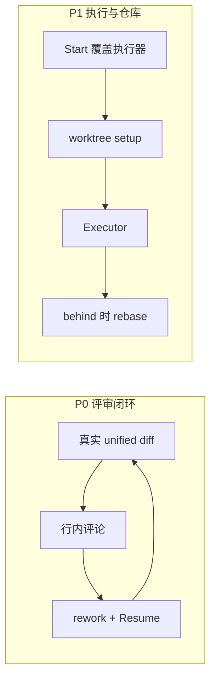

# 评审闭环与执行器覆盖

> 开发设计文档（已落地 A–D）。承接 [隔离执行、可插拔编码、真实评审](./autodev-isolation-executor-review.md) 的「本期不做」清单，对照 Vibe Kanban 后按杠杆重排。  
> 规格驱动主流程不变：对话 → Dev Spec → Auto-Dev → 人工评审 → 本地合并。  
> **默认编码仍是内置 VibeBot**；不做成必须先装 Claude/Codex 才能干活的编排壳。

## 背景与目标

隔离 worktree、可插拔 Executor、真实 diff 已经落地。对照 Vibe Kanban，用户每天真正顺的是三件事，我们还缺：

1. **看完 diff 立刻把意见钉在具体 hunk 上**，而不是整段返工说明。
2. **这一次 Job 可以换执行器**，失败后再试 Claude / Cursor，不必改全局设置。
3. **worktree 能装依赖、能跟上基线**；远程 PR 可选，不是必经之路。

不做：云端团队看板、内嵌 DevTools 浏览器、为每个 agent 写私有协议、npx 分发。



---

## 做成之后什么样

1. Review 里可以对某文件某几行写评论；提交后走现有 rework 通道，prompt 带 `repo / path:line`，并尽量 **resume 原 agent session**（同一特性分支续跑，不新开 worktree）。
2. 「启动自治开发」可选本次执行器（默认用全局设置）。Job / `PRInfo.Executor` 记录实际用的名字。未安装的 CLI 不可选。
3. 项目可为每个 Git 仓配置 `setupCommand`（如 `npm install`）。worktree 创建后、编码前执行，输出进 Auto-Dev SSE。
4. Diff 顶栏 `behind > 0` 时出现「变基到默认分支」。冲突则停住、保留 worktree，提示打开编辑器。
5. 可选：把特性分支 `git push` 并用 `gh pr create`（失败不阻断本地 Approve）。

看板状态机不改。`in_review → 二次修改 → 更新 Spec（可选）→ Auto-Dev` 仍走现有 `handleReworkSubmit`。

---

## 分期

| 阶段 | 内容 | 依赖 |
|------|------|------|
| **A** | Diff 行内评论 + 定点 rework + Resume | 现有 DiffReview、rework、`CodingRequest.Resume` |
| **B** | Start body 覆盖执行器 | 现有 `ExecutorConfig`、`GET /api/executors` |
| **C** | 仓级 setup + rebase | worktree 已落地；Diff 已有 ahead/behind |
| **D**（可选） | `git push` + `gh pr create` | C 完成、本机有 `gh` 且已登录 |

A 必须先做：不改状态机，接得上现有返工。B 与 C 可并行。D 不做也不影响本地闭环。

同一 Issue 并行开第二 worktree「Claude vs Codex 对打」**放在 B 之后、不在本期默认范围**：先串行「换执行器再试」，避免双开打爆本机配额。同仓 `.git` 短锁已经允许并行，UI 以后再暴露。

---

## A. Diff 行内评论 → 定点返工

### 用户路径

1. Issue 在 `in_review`，打开 Code Review。
2. 左侧选文件，unified diff 中拖选或点选连续的 `+` / 上下文行。
3. 右侧或行尾弹出评论框，写下意见。可挂多条。
4. 「按评论返工」：把评论编进 rework prompt，范围默认当前子需求（若有）否则整单；启动 Auto-Dev 时 `resume=true`。
5. 编码在 **同一 `ai-dev/issue-*` 分支 / 同一 worktree** 上进行。完成后仍回 `in_review`，diff 刷新。

整单文本返工框保留，作为「没有选行」时的入口。

### 数据

```go
type DiffComment struct {
    ID        string `json:"id"`
    RepoID    string `json:"repoId"`
    Path      string `json:"path"`
    Side      string `json:"side"`      // "new" | "old"  （+ 行 / - 行）
    StartLine int    `json:"startLine"` // 该 side 上的文件行号
    EndLine   int    `json:"endLine"`
    Quote     string `json:"quote"`     // 选中的 diff 文本，截断 2KB
    Body      string `json:"body"`
    CreatedAt string `json:"createdAt"`
}

// Issue 新增：
ReviewComments []DiffComment `json:"reviewComments,omitempty"`
AgentSessionID string        `json:"agentSessionId,omitempty"` // 最近一次 Executor.Result.SessionID
```

评论存在 Issue JSON 里即可（与 `chatMessages` 一样），不必新表。Approve / 删除 Issue 时一起丢掉。

`parseUnifiedDiff` 目前只分类 `kind`，没有文件行号。A 阶段给每条 `add`/`del`/`ctx` 补上 `oldLine` / `newLine`（由 hunk 头 `@@ -a,b +c,d @@` 累加）。`meta`/`hunk` 不可评论。

### Prompt 拼装

`handleReworkSubmit` 在用户原意见之外追加：

```
Review comments (fix these hunks; do not unrelated refactors):
- [ziya] internal/foo.go:new:42-58
  """quoted lines"""
  把超时错误映射到 LLMRecoveryBar，不要改重试次数。
```

`developOne` 已把 `sessionID` 写入后续 `CodingRequest.Resume`。A 阶段：

- Job 成功且 `Result.SessionID != ""` 时写到 `issue.AgentSessionID`。
- 下一次该 Issue 的 Auto-Dev（含评论返工）把 `Resume: issue.AgentSessionID` 传给 Executor。
- 内置 LLM 路径：Resume 只作为 Extra 里的「上次会话说明」，不假设 CLI 能续跑。
- Agent 路径：prompt.go 已有 `Resume / prior session note`；Claude/Cursor 若支持 session 参数，在 **preset 模板**里用 `{session}` 占位（没有则仍只把 ID 写进 prompt 正文）。**不要**为此分叉两套 worker。

换执行器（阶段 B）时清空 `AgentSessionID`（不同 CLI 的 session 不能混用）。

### API / UI

| 方法 | 路径 | 说明 |
|------|------|------|
| `PUT` | `/api/issues/{id}` | 现有更新即可带上 `reviewComments`（乐观写） |
| 现有 | rework → `handleSendMessage` + `onStartAutoDev` | prompt 由前端或后端 `formatReviewComments()` 生成 |

前端：`DiffReview.tsx` 行可点、可拖；选区高亮；底部评论列表；主按钮「按评论返工」调用现有 rework（`forceSpecSync` 仍可开，让 Spec 记下这次修改点）。

### 验收

- 未选行时不能点「按评论返工」；整单文本返工仍可用。
- 评论 prompt 含路径与行号；Auto-Dev 复用同一 worktree 路径。
- Agent 第二次 Job 的日志里能看到 Resume 段；LLM 路径不报错。
- `go test`：`diffFormat` 行号累加；`formatReviewComments` 截断。

---

## B. Start 时覆盖执行器

### 行为

全局 `PUT /api/settings/executor` 仍是默认。`POST /api/auto-dev/start` 增加可选字段：

```go
type autoDevStartBody struct {
    IssueID          string               `json:"issueId"`
    SubRequirementID string               `json:"subRequirementId,omitempty"`
    Executor         *model.ExecutorConfig `json:"executor,omitempty"` // 缺省 = 全局
}
```

- `Executor == nil`：与今天完全一致，读 `GetExecutorConfig()`。
- 非空：`Normalize` + `Validate`，agent preset 必须 `GET /api/executors` 为 available，否则 400（文案用现有 hint）。
- `Runner` 在 `run()` 里优先用 **Job 上记下的快照**，避免跑到一半用户改了全局设置。

Job / `PRInfo.Executor` 已有显示名。补存规范化后的 config JSON（可放 `autodev_jobs` 现有结构或 Issue `PRInfo` 旁的 `job.ExecutorConfig`）。最小改动：`model.AutoDevJob` 增加 `ExecutorConfig *ExecutorConfig`，CreateJob 时写入。

### UI

看板「启动自治开发」与 Issue 头按钮弹出与设置页相同的短选择器（LLM / Claude / Cursor / Codex / 自定义），默认选中全局值。灰色项不可点。

本期 **一个 Issue 同时只允许一个 running Job**（现有 409）。「换执行器再试」= 等当前结束或取消后，用新 preset 再 Start；worktree 复用同分支。

### 验收

- 不传 `executor` 的旧客户端行为不变。
- 传未安装 `claude` → 400，不创建 Job。
- Review 顶栏显示这次实际执行器，不是后来改过的全局值。
- `go test`：start handler 覆盖 / 校验。

---

## C. Setup 与 rebase

### Setup

```go
type GitRepo struct {
    // ...现有字段
    SetupCommand string `json:"setupCommand,omitempty"` // 例: "npm install" 或 "make tidy"
}
```

`prepareWorktrees` 成功后、第一次 `executor.Run` 前：

- 若 `SetupCommand` 非空，在 **该仓 worktree** 里 `sh -c`（Windows 用 `cmd /c`）执行，超时 10 分钟，stdout/stderr 进 `appendLog(phase="setup")`。
- 失败：Job 失败、Issue 回 backlog、worktree 保留（与测试失败相同）。空命令跳过。

项目设置里每个关联仓一个可选输入框。不做「自动探测 package.json」——避免在不含前端的仓里乱跑 npm。

### Rebase

已有：`GET /api/issues/{id}/diff` 返回 `ahead` / `behind`。

新增：

```
POST /api/issues/{id}/rebase
```

- 对每个 worktree：`git -C worktree rebase <baseBranch>`（base 来自 `PRInfo.BaseBranch`）。
- 成功：返回新的 ahead/behind。
- 冲突：中止 rebase（`rebase --abort` **不要**自动执行，除非尚未改工作区；若已冲突则保持冲突状态）、400 + 冲突文件列表，UI 提示 open-editor。
- 仅 `in_review` 或 `backlog`（失败留下的 worktree）可点；`in_progress` 拒绝。
- 实现放 `internal/gitx`：`RebaseOnto(worktreePath, base)`，单测用临时仓。

Diff 顶栏 `behind > 0` 显示按钮「变基到 {base}」。

### 验收

- 无 setup 的仓与今天行为一致。
- 故意写 `setupCommand: false` 或失败命令 → Job failed、worktree 仍在。
- behind 为 0 不显示 rebase。
- 冲突仓：按钮报错，worktree 内能看到冲突标记。
- `go test ./internal/gitx/ ./internal/autodev/`。

---

## D.（可选）推远程与 PR

默认仍然 **只本地 merge**（Approve = `MergeBranchAt`）。

项目或 Issue 上可选开关 `publishRemote`：

1. `git -C worktree push -u origin <branch>`（origin 必须已存在）。
2. 若 `PATH` 有 `gh`：`gh pr create --base <default> --head <branch> --title --body`，body 用现有 `prDescription`。
3. 任一步失败：日志 Warn，**不**把 Issue 打成 failed；本地 Approve 仍可用。
4. Prompt / Agent 安全规则保持「编码过程禁止 push」；push 只发生在用户点了「发布到远端」之后，由 **vibecoding 自己**调 git/gh，不交给 agent。

无 `gh`、无 origin 时按钮灰色并 hint。

---

## 明确不做（仍有效）

| 项 | 原因 |
|----|------|
| 云端组织 / 远程 Issue | Vibe Kanban 已关停该层；本仓库坚持 `~/.vibecoding` |
| 内嵌预览浏览器 + 设备模拟 | 工程量大；C 之后如需预览，用项目 `devCommand` + 系统浏览器即可，不在本期 |
| 看板 MCP / Cursor ACP | 应对齐现有 `/api`，单独立项 |
| Gemini / Copilot / OpenCode preset | Executor 接口已在；B 稳定后再加探测，不为每个 CLI 写 JSON-RPC |
| 拖拽改看板列 | 纯 UX；状态校验（缺 Spec 不能进 backlog）必须留下 |
| 同 Issue 双 worktree 并行对打 | B 之后再做；本期串行换执行器 |
| npx 分发 | 已有 server 二进制与 Docker |

---

## 文件与接口一览

| 位置 | 变更 |
|------|------|
| `internal/model/model.go` | `DiffComment`、`ReviewComments`、`AgentSessionID`、`GitRepo.SetupCommand`、Job 快照 ExecutorConfig |
| `web/src/lib/diffFormat.ts` | hunk 行号 |
| `web/src/components/DiffReview.tsx` | 选行、评论、rebase 入口 |
| `web/src/components/issue-detail/IssueReviewTab.tsx` | 「按评论返工」 |
| `internal/api/autodev_handlers.go` | start 覆盖执行器；rebase；可选 publish |
| `internal/autodev/worker.go` / `worktree.go` / `develop.go` | setup、Resume 从 Issue 读取、Job 用快照 config |
| `internal/gitx` | `RebaseOnto` |
| `internal/executor/prompt.go` / presets | `{session}` 可选 |
| `web/src/components/ProjectModal.tsx` | 每仓 setup |
| `web/src/lib/i18n.ts`、README | 用户说明 |
| 本文 | 开发设计 |

---

## 验收总表

每阶段提交前：`go test ./...`，前端 `web/node_modules/.bin/tsc --noEmit`。

手动（A→C）：

1. 完成一单 Auto-Dev → Review 对某 `+` 行评论 → 返工 → 同一 worktree 再出 diff，评论点被改到。
2. 全局 LLM，Start 时改选本机已登录 Cursor → Job 顶栏为 cursor；再 Start 不传覆盖则回到 LLM。
3. 仓填 `setupCommand=npm install`（有 package.json 的仓）→ 日志有 setup 阶段再 coding。
4. 故意让默认分支多一个 commit → behind≥1 → rebase 成功 ahead 增加；制造冲突则拒绝并保留 worktree。
5. 未装 CLI、无 setup、behind=0：回归路径与现网一致。

---

## 建议实现顺序

1. **A1** `diffFormat` 行号 + DiffReview 选区（可先不接 Auto-Dev，评论只落 Issue）。
2. **A2** 评论编进 rework prompt + `AgentSessionID` Resume。
3. **B** start `executor` 覆盖 + UI 选择器。
4. **C** setup 然后 rebase。
5. **D** 有远端需求再做。
